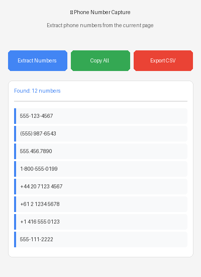

# 📱 Chrome Phone Capture

A Chrome extension that extracts and captures phone numbers from web pages with one click.



## Features

- 🔍 **Smart Detection**: Automatically finds phone numbers in various formats (US, international, with/without country codes)
- 📋 **Copy to Clipboard**: Copy all extracted phone numbers with one click
- 📊 **CSV Export**: Export phone numbers to a CSV file for easy import into other tools
- 🎨 **Clean UI**: Modern, intuitive interface with real-time results
- 🚫 **False Positive Filtering**: Intelligently filters out dates, version numbers, and other non-phone patterns
- 🔒 **Privacy-Focused**: All processing happens locally in your browser

## Supported Phone Number Formats

The extension recognizes various phone number formats including:

- US/Canada: `(123) 456-7890`, `123-456-7890`, `123.456.7890`, `1234567890`
- With country code: `+1-123-456-7890`, `+1 (123) 456-7890`
- International: `+44 20 7123 4567`, `+61 2 1234 5678`
- Generic: `123-456-7890`, `123 456 7890`

## Installation

### From Source (Developer Mode)

1. Clone or download this repository:
   ```bash
   git clone https://github.com/Northeast-webdev/chrome-phone-capture.git
   ```

2. Open Chrome and navigate to `chrome://extensions/`

3. Enable "Developer mode" by toggling the switch in the top-right corner

4. Click "Load unpacked" button

5. Select the `chrome-phone-capture` directory

6. The extension is now installed! You should see the phone icon in your Chrome toolbar

## Usage

1. Navigate to any webpage containing phone numbers

2. Click the Phone Number Capture extension icon in your Chrome toolbar

3. Click the "Extract Numbers" button

4. View the extracted phone numbers in the results panel

5. Use the action buttons to:
   - **Copy All**: Copy all phone numbers to your clipboard
   - **Export CSV**: Download a CSV file with all phone numbers

## Example Use Cases

- 📇 **Contact List Building**: Extract phone numbers from business directories
- 🔍 **Research**: Gather contact information for market research
- 📞 **Lead Generation**: Compile phone numbers from company websites
- 📋 **Data Collection**: Extract phone numbers from documents or web pages for data entry

## Development

### Project Structure

```
chrome-phone-capture/
├── manifest.json          # Extension configuration
├── popup.html            # Extension popup UI
├── popup.js              # Extension logic and phone extraction
├── icons/                # Extension icons (16x16, 32x32, 48x48, 128x128)
│   ├── icon16.png
│   ├── icon32.png
│   ├── icon48.png
│   └── icon128.png
└── README.md             # This file
```

### Key Components

- **manifest.json**: Defines extension metadata, permissions, and resources
- **popup.html**: The user interface displayed when clicking the extension icon
- **popup.js**: Contains the extraction logic and UI interactions

## Privacy

This extension:
- ✅ Only runs when you click the extension icon
- ✅ Processes all data locally in your browser
- ✅ Does NOT send any data to external servers
- ✅ Does NOT collect or store any personal information
- ✅ Requires minimal permissions (only `activeTab` and `scripting`)

## License

MIT License - feel free to use, modify, and distribute this extension.

## Contributing

Contributions are welcome! Please feel free to submit a Pull Request.

## Support

If you encounter any issues or have suggestions, please open an issue on the GitHub repository.

## Changelog

### Version 1.0.0
- Initial release
- Phone number extraction from web pages
- Support for multiple phone number formats
- Copy to clipboard functionality
- CSV export functionality
- Clean, modern UI
